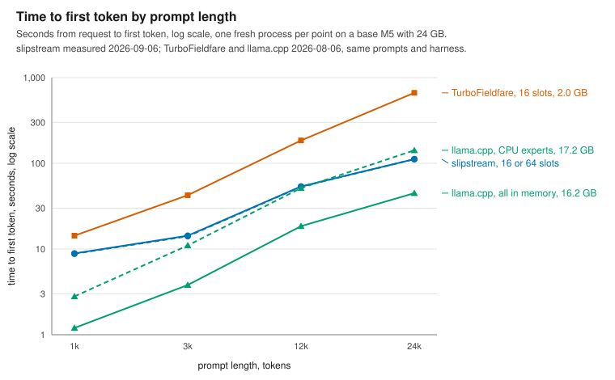
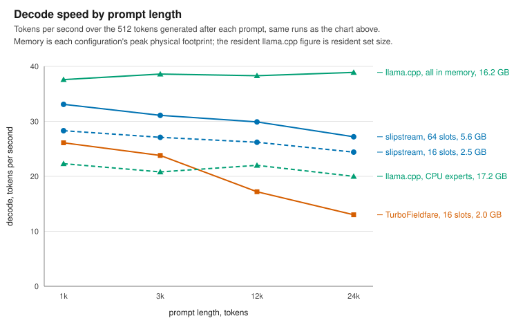
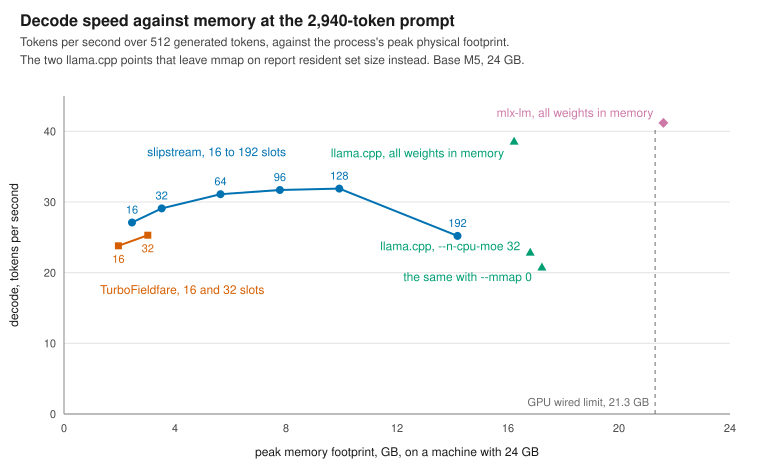

# slipstream

The fastest measured way to run a mixture-of-experts model on Apple Silicon
without holding its weights in memory, at a footprint you set.

[Qwen3.6-35B-A3B](https://huggingface.co/Qwen/Qwen3.6-35B-A3B) is a
mixture-of-experts model: each of its 40 layers holds 256 expert networks and
routes every token through eight of them, and those experts are 18 GB of
weights.[^1] A runtime that loads all of them needs 16 to 22 GB of memory
before it counts the context window.[^2] A Mac's memory is fixed when it is
bought. On a 24 GB laptop that leaves nothing for the editor, the browser, and
the coding agent that drives the model, and a 16 GB laptop cannot hold the
model at all. The usual choices are a smaller model, a shorter context, or a
machine that swaps. slipstream is a fourth choice. It keeps the weights on the
SSD and reads, for each token, only the eight experts that token routes to,
into a cache whose size you choose. On a base M5 MacBook Pro with 24 GB it
decodes at 31.1 tokens per second in 5.6 GB of memory, or 27.1 tokens per
second in 2.5 GB, on a 2,940-token prompt.[^3] The rest of the machine keeps
its memory, and a context of 32k tokens costs about 0.7 GB more.[^4]

slipstream is a composition of the ideas that worked in neighboring projects
and in published research, and every one of them stayed on evidence: each was
measured on this machine and kept or dropped on its number. From
[TurboFieldfare](https://github.com/drumih/turbo-fieldfare) comes the
streaming design: experts stored on the SSD so that each is one read, a cache
of fixed size per layer, and kernels that read an expert's 4-bit weights
once.[^5] From [oMLX](https://github.com/jundot/omlx) come a prompt cache that
persists to disk and a memory guard on the number macOS kills a process
on.[^6] From [gpu-kernel](https://github.com/dwijenpatel/gpu-kernel), a
companion research repository, come kernels for the M5's tensor units, the
matrix hardware inside each GPU core, written against the machine's measured
ceilings rather than its data sheet.[^7] From the caching literature comes the
expert-cache policy: least frequently used with decay, every expert's use
count halved every 32 tokens, chosen by replaying recorded routing traces
through nine policies against the best any policy could do with knowledge of
the future. From the literature on offloading mixture-of-experts models came
prefetch on predicted routing, which was built, measured, and left off. Two
pieces are this project's own. A decode attention kernel that reads each key
and value row once per key-value head runs at about 90 percent of the measured
memory bandwidth. And the GPU clock is held up across SSD waits, a term this
project has found in no published profile of a streaming runtime.

Every number on this page comes from a harness, the script that runs the
measurements, built so that a run measures the code and not the state of the
machine. The file cache, the memory the operating system lends to recently
read files, is the largest confound on a runtime that streams from the SSD:
the same configuration once read 14 percent faster late in a session than
early, from warmth alone.[^8] So each configuration runs in a fresh process,
every configuration meets the same cache state, and one configuration is
measured again at the end to catch drift; a run whose repeat moves more than 5
percent is discarded. The workloads are four prompts of 889 to 23,827 tokens
and a ten-turn coding session recorded through the server and replayed.
Section 4 lists the ideas that were measured and left out, speculative
decoding among them.

## 1. What was measured

Every number comes from one machine, a base M5 MacBook Pro with a 10-core GPU
and 24 GB of memory, macOS 26.5.2, the internal SSD, and a GPU wired limit,
the most memory macOS lets the GPU hold, of 21.3 GB. Each entry in the tables
prefills one of four prompts of 889, 2,940, 11,738, and 23,827 tokens, prefill
being the pass over the prompt that precedes the first token, and then
generates 512 tokens. The slipstream rows were measured on 2026-09-06, and the
repeated configuration at the end of that run moved 0.8 percent. The
TurboFieldfare and llama.cpp rows were measured on 2026-08-06 on the same
harness and prompts, with TurboFieldfare built from its own tree at its own
defaults.[^3] Every chart on this page is a measurement made here; none is
inferred.

Memory is controlled by one setting: how many of each layer's 256 experts stay
in memory. Each expert is 1.77 MB and the setting applies to each of the 40
layers, so keeping 16 experts per layer costs at most 1.1 GB and keeping 64
costs at most 4.5 GB; the default is 64. The tables and charts count these as
slots, one slot being one expert kept in memory for one layer. Peak memory in
the tables is the process's peak physical footprint at the 2,940-token prompt,
the number macOS compares with its limit, except in the two llama.cpp rows
that leave the weights memory-mapped, `mmap` on. There the weights are
file-backed and the footprint counts almost nothing, so those rows report
resident set size, the memory the process has in use.



Read the vertical distance at 24k tokens: slipstream takes 112 seconds where
TurboFieldfare takes 665 and llama.cpp with its experts moved to the CPU takes
142. llama.cpp with every weight in memory takes 45 seconds, at 16.2 GB. The
two slipstream settings lie on one line, because prefill time does not depend
on the cache size; section 2.1 says why.



Decode speed falls with prompt length on slipstream and TurboFieldfare and
holds on llama.cpp with all weights in memory. slipstream at 64 slots runs
between 33.1 and 27.2 tokens per second across the four prompts, and at 16
slots between 28.3 and 24.4; TurboFieldfare falls from 26.1 to 13.0. At 24k
tokens slipstream at 16 slots, in 2.5 GB, decodes faster than llama.cpp with
its experts on the CPU, in 17.2 GB.

Time to first token, in seconds, by prompt length:

| runtime and setting                        | peak memory | 1k   | 3k   | 12k   | 24k   |
| ------------------------------------------ | ----------- | ---- | ---- | ----- | ----- |
| TurboFieldfare, 16 slots (its default)     | 2.0 GB      | 14.3 | 42.5 | 185.1 | 664.8 |
| TurboFieldfare, 32 slots                   | 3.0 GB      | 15.5 | 70.5 | 265.5 | 720.5 |
| slipstream, 16 slots                       | 2.5 GB      | 8.8  | 14.1 | 53.4  | 111.6 |
| slipstream, 32 slots                       | 3.5 GB      | 8.9  | 14.3 | 53.6  | 112.0 |
| slipstream, 64 slots (default)             | 5.6 GB      | 8.9  | 14.3 | 53.7  | 112.0 |
| slipstream, 96 slots                       | 7.8 GB      | 9.0  | 14.4 |       |       |
| slipstream, 128 slots                      | 9.9 GB      | 9.1  | 14.4 |       |       |
| slipstream, 192 slots                      | 14.2 GB     | 9.3  | 14.7 |       |       |
| llama.cpp, all weights in memory           | 16.2 GB RSS | 1.2  | 3.8  | 18.5  | 44.9  |
| llama.cpp, `--n-cpu-moe 32`                | 16.8 GB RSS | 2.5  | 7.8  | 35.0  | 78.2  |
| llama.cpp, `--n-cpu-moe 32 --mmap 0`       | 17.2 GB     | 2.8  | 11.0 | 51.4  | 141.8 |
| slipstream, resuming a saved prompt cache  | 2.5 GB      |      | 0.03 |       |       |

Sustained decode, in tokens per second over the 512 generated tokens:

| runtime and setting                        | peak memory | 1k   | 3k   | 12k  | 24k  |
| ------------------------------------------ | ----------- | ---- | ---- | ---- | ---- |
| TurboFieldfare, 16 slots (its default)     | 2.0 GB      | 26.1 | 23.8 | 17.2 | 13.0 |
| TurboFieldfare, 32 slots                   | 3.0 GB      | 28.1 | 25.3 | 17.5 | 13.1 |
| slipstream, 16 slots                       | 2.5 GB      | 28.3 | 27.1 | 26.2 | 24.4 |
| slipstream, 32 slots                       | 3.5 GB      | 30.6 | 29.1 | 28.1 | 26.1 |
| slipstream, 64 slots (default)             | 5.6 GB      | 33.1 | 31.1 | 29.9 | 27.2 |
| slipstream, 96 slots                       | 7.8 GB      | 34.0 | 31.7 |      |      |
| slipstream, 128 slots                      | 9.9 GB      | 34.7 | 31.9 |      |      |
| slipstream, 192 slots                      | 14.2 GB     | 31.3 | 25.2 |      |      |
| llama.cpp, all weights in memory           | 16.2 GB RSS | 37.6 | 38.6 | 38.3 | 38.9 |
| llama.cpp, `--n-cpu-moe 32`                | 16.8 GB RSS | 22.9 | 22.9 | 22.9 | 23.3 |
| llama.cpp, `--n-cpu-moe 32 --mmap 0`       | 17.2 GB     | 22.3 | 20.8 | 22.0 | 20.0 |
| mlx-lm, all weights in memory              | 21.6 GB     |      | 41.2 |      |      |

The llama.cpp rows come from `llama-bench`, which times prompt processing and
generation as separate loops instead of serving a request, so they are a best
case rather than a like-for-like measurement.[^9] The mlx-lm row was measured
once, at the 3k prompt, because its 21.6 GB peak sits above the wired limit
and its first run also materialized 19 GB of mapped weights; its time to first
token is left out because that run charged the materialization to
prefill.[^10] The 12k and 24k entries at 96, 128, and 192 slots are blank. The
overnight run refused those prompts through a defect in the prefill memory
guard, since fixed, and a daytime rerun failed its drift check.[^11] The
resume row has no decode figure because prefill also fills the expert cache,
so decode after a resume starts against an empty one and climbs as the slots
refill; the honest figure is a curve, and it has not been measured.[^12]

## 2. Where the time goes

Two clocks matter to a person typing at a model. The first is the wait for the
first token, which is the prefill of the prompt. The second is the rate after
it, which is decode. Different terms govern each, and memory reaches each by a
different route.

### 2.1 Time to first token

Prefill runs the prompt through the model in chunks of up to 4,096 tokens.
Each chunk streams the experts its tokens route to, which on this model is
most of the 18 GB pool, so the number of chunks sets the expert traffic, not
the number of tokens. A 2,940-token prompt processed as one chunk reads 38 GB
where 128-token chunks read 247 GB, and its prefill takes 18.5 seconds instead
of 63.3.[^13] Above 4,096 tokens the runtime reads the pool once per chunk,
and whether those reads come from the file cache or the SSD makes no
measurable difference: at 12k the prefill took 54.3 seconds with the file
cache empty, so that every expert came from the SSD, and 53.9 with the cache
holding the pool, and at 24k 112.6 against 112.4.[^14] Cold and warm, from
here on, name those two states. The reads hide behind the GPU.

What remains is compute, and it is linear in the prompt: about 4.5 ms per
token at every length, 14.3 seconds at 3k and 112 at 24k. It was not always
linear. Until 2026-09-04 the ten full-attention layers, where each token's
query is scored against every earlier token's key, ran on a kernel that gave
one group of GPU threads to each query token and re-read the keys and values
once for each of the 16 query heads, at about one percent of the tensor unit's
ceiling, so the cost of a chunk grew with the number of keys already in
context. A kernel ported from gpu-kernel replaced it: tiles of 32 queries by
128 keys, both matrix products on the tensor units, and the eight query heads
that share a key-value head walking the keys together. The three chunks of the
12k prompt took 18.3, 18.1, and 16.1 seconds where they had taken 26.3, 42.8,
and 53.3, and the time to first token went from 116.9 seconds to 53.4 at 12k
and from 381.7 to 111.6 at 24k.[^15]

The slot count does not touch time to first token until it starves the file
cache. From 16 to 128 slots the 3k prefill takes 14.1 to 14.4 seconds. At 192
slots the cache alone holds 13.6 GB, the file cache has nothing left to absorb
the per-chunk re-reads, and the 12k prefill measured 145 seconds against 117
in August and 88 against 53 in September. Both of those runs failed their
drift check, so the size of the cliff is uncertain and its direction is
not.[^16]

A prompt is paid for once per process. After a fresh prefill the command-line
tool can write the whole cache to disk, including the state of the thirty
linear-attention layers, which carry a fixed-size state forward token by token
instead of the growing store of keys and values that full attention keeps, so
that state cannot be sliced by token. In August the 2,940-token prompt took
17.65 seconds to prefill and came back in 0.03 seconds on the next run, with
byte-identical output.[^12] The server keeps one conversation's prefix in
memory, so each turn of a coding agent prefills only its new tokens.

### 2.2 Tokens per second

On a warm machine at 128 slots one token costs 40.7 ms.[^17] The routed
experts' feed-forward takes 6.5 ms, the thirty linear-attention layers 6.1,
the ten full-attention layers 2.4, the output head 2.4, and the norms and
router 1.3. Waiting for expert reads takes 7.8 ms. Waiting for the GPU between
layers takes 9.0. The remaining 5.2 ms is command encoding and time the
counters do not attribute.

Three of those terms sit at floors this project has measured. The output head
runs at about 93 percent of the machine's measured 120.4 GB/s memory
bandwidth, and the full-attention scan at about 90 percent, after a kernel
that reads each key and value row once per key-value head instead of once per
query head, 2.49 times faster than the inherited one.[^18] The wait between
layers is a floor of a different kind. Every layer sends its routing choice
back to the CPU, which fetches the chosen experts, so every layer ends in a
command-buffer round trip, the CPU submitting the layer's GPU work and waiting
for it to finish, of about 207 microseconds regardless of the work inside it,
and 40 of them make about 8.3 ms.[^19] The routed feed-forward reads about 566
MB per token, which at the measured bandwidth is a 4.7 ms floor against 6.5
measured; that 1.8 ms is the largest kernel-level gap left in decode.

The terms memory governs are the expert reads and, on a small cache, the GPU
clock.

### 2.3 What memory buys



Read the slipstream curve left to right. It rises from 27.1 tokens per second
at 2.5 GB to 31.9 at 9.9 GB and falls to 25.2 at 14.2 GB. To its right, the
runtimes that hold every weight in memory sit at 16 to 22 GB: llama.cpp at
38.6 and mlx-lm at 41.2, and llama.cpp with its experts on the CPU at 20.8, in
17.2 GB.

The curve has three regions. From 16 to 64 slots each doubling buys 7 percent:
27.1, 29.1, and 31.1 tokens per second at 2.5, 3.5, and 5.6 GB. From 64 to 128
the gain flattens to 3 percent, 31.9 at 9.9 GB, because on a machine with 24
GB the file cache already holds most of what the extra slots would, and the
misses they remove were being served from memory. At 192 slots, 14.2 GB, the
speed falls to 25.2. The expert cache and the file cache compete for the same
memory, and past 128 slots the cache evicts the file pages that were absorbing
its own misses, so the setting that misses least is among the slowest. The
optimum belongs to the host, not the model, and will move on a machine with a
different amount of memory.

That curve was measured on an otherwise idle machine, where the file cache
holds part of the expert pool and a miss is a memory copy of about 0.2 ms. On
the machine slipstream is built for, one that is also running an editor, a
browser, and the agent that drives the model, the file cache holds little,
every miss is an SSD read of about 0.36 ms, and the slot count matters
more.[^20] Two terms appear there that a warm machine hides. The first is the
GPU clock. Measured at 16 slots with the file cache bypassed, so that every
expert read came from the SSD, expert reads took 59 ms of each token, and the
decode kernels took 28 ms instead of the 13 ms they take warm, because the
chip lowered the GPU clock during each layer's read gap and ran the next
layer's kernels at the low clock. One group of 32 GPU threads kept looping on
a second command queue holds the clock up, and decode went from 9.5 to 12.6
tokens per second with byte-identical output.[^21] The hold is on by default
and stops under macOS Low Power Mode.

The second term is the cache policy. A replacement policy's behavior depends
only on the sequence of experts each layer requests, so the runtime records
that sequence, and a script replays it through any policy at any slot count in
seconds, reproducing the runtime's own miss counters exactly.[^22] On the
recorded coding session the inherited policy, least frequently used with
counts kept for the life of the process, held early favorites in memory after
the work moved on: 98.8 misses per token at 64 slots, a miss being an expert
the cache does not hold and must read. Halving every expert's count every 32
tokens, the aging policy, cut that to 71.8. Least recently used gave 77.2, and
the offline optimum, which knows the future, 39.1. Replayed with every expert
read from the SSD, the session ran 15 percent faster under the aging policy,
and on a warm machine 7 percent faster.[^20] It is the default.

Put together: on the machine slipstream is built for, a small cache runs the
SSD near its limit with the GPU at a held clock, and a larger cache converts
SSD reads into hits until it begins to evict the file cache. Time to first
token is the same at every setting short of that last one.

## 3. Running it

The requirements are macOS 26 with Metal 4 and Swift 6.2 or newer. Build the
products, then repack the pinned Qwen3.6 checkpoint into the runtime's
page-aligned expert layout; the repacker fetches byte ranges from Hugging Face
rather than a whole snapshot, and the result takes about 19.6 GB on disk.

```bash
swift build -c release
```

```bash
.build/release/slipstream-repack --model qwen36 --output ~/models/qwen36.gturbo
```

Generate from the command line. `--expert-cache-slots` sets how many experts
per layer stay in memory, `--kv-snapshot <path>` saves the cache after a fresh
prefill and restores it on the next identical prompt, and `--gpu-clock-hold`
and `--expert-cache-policy` expose the two decode terms of section 2.3.

```bash
.build/release/slipstream --model ~/models/qwen36.gturbo --prompt "The capital of France is" --max-new 64
```

Serve on the loopback interface. The server speaks the OpenAI chat-completions
API and the Anthropic messages API, serves a chat page at its root, keeps one
conversation's prefix in memory, and cancels generation when the client
disconnects. `Scripts/claude-local.sh` points Claude Code at it.

```bash
.build/release/slipstream-server --model ~/models/qwen36.gturbo --port 8091 --max-context 65536
```

The server binds to `127.0.0.1` with no authentication; do not expose it. Run
one model process at a time, because a second one competes for the same memory
and contaminates every measurement. `Scripts/test.sh` runs the serial test
suite, 670 tests at the time of writing.

## 4. Measured and left out

Each of these was built or replayed, measured on this machine, and kept out of
the default configuration. The numbers say why.

**Speculative decoding.** The scaffold drafts by prompt lookup, guessing the
next tokens from earlier repeats in the text, verifies a round of up to eight
tokens in one forward pass, and repairs the linear-attention state when a
draft is rejected. On a code continuation it accepts 41.6 percent of drafted
tokens for 3.91 emitted tokens per round, and it decodes at 22.3 tokens per
second against 28.6 sequential at 128 slots, and 17.0 against 27.3 at 64,
where the experts a round's tokens need between them, 32 per layer, thrash the
cache.[^23] The cost is not acceptance. Below 32 rows every batched matrix
kernel available here costs about one weight read per row, so verifying eight
tokens re-read the weights eight times. A multi-row 4-bit kernel that reads
each weight row once now serves the projections and the head and took the
verify round from 178 to 137 ms; running a round's experts as one grouped GPU
dispatch per layer gained 2 to 3 percent; and the remaining cost is the
linear-attention recurrence, which walks the round's rows one at a time. It
stays off until a round costs near 1.3 decode tokens.

**Prefetch on predicted routing.** Applying the next layer's router to the
current layer's state picks 79.7 percent of the experts that layer will want,
and 72.8 percent two layers ahead.[^24] On a warm machine at 16 slots,
prefetching on that guess cut the measured disk wait from 15.95 to 7.01 ms per
token and made decode 11 percent slower, because the runtime already overlaps
the wait with GPU work and the early reads crowd a saturated memory bus. With
every expert read from the SSD at 64 slots, prefetching one layer ahead tied,
22.6 against 22.7 tokens per second, and two layers ahead lost 10 percent,
because the wrong guesses cost 37 percent more bytes one layer ahead and 47
percent two ahead, on an SSD with no room for them. On the coding session the
same prefetch ran 6 percent slower than none.

**Removing the per-layer round trip.** Replacing the command-buffer wait with
a GPU fence and a CPU spin was bit-identical and 15 percent slower, because
the GPU's writes become visible to the CPU at about the same boundary
anyway.[^25] Inverting the dependency with shared events, one command buffer
per token with the GPU waiting for the CPU's signal at each layer, costs
nothing when the CPU has already signaled, but a parked GPU restarts in 100 to
190 microseconds, as much as the 197-microsecond commit it would replace.
Merging 41 of the per-token synchronization boundaries changed decode by under
2 percent.

**Reading the expert pool once per prompt.** A layer-major prefill schedule
would read the pool once for the whole prompt instead of once per chunk.
Section 2.1 measured the stream it would remove at under one percent of
prefill time.

**Other cache policies.** Replayed on the same routing traces at 64 slots, six
published policies, least recently used, ARC, LRFU, a windowed TinyLFU shape,
S3-FIFO, and SIEVE, left between 72.1 and 77.2 misses per token against
aging's 71.8, and LRFU at its best decay landed on the same number, so
periodic halving sits at the recency-frequency optimum for this workload.[^26]
Per-layer slot allocation at a fixed total, trained on one trace and scored on
the other, moved misses by under 0.3 percent in both directions. A predictor
built from each layer's own token-to-token transitions covered 5 percent of
misses at 64 slots for about 1 ms of bookkeeping per token, and was not built.

**A staged-activation expert kernel.** A fork of TurboFieldfare reported the
first phase of its expert kernel at 56 percent of peak, up from 38, by staging
the shared activation in the GPU's on-chip shared memory, on an M3. On the M5
the same variant measured 25.3 and 26.0 tokens per second against 25.9 and
25.3 unstaged, inside the spread of a pair, and stays behind a switch.[^27]

**Read-ahead advice.** Read-ahead advice on the expert files, in three
variants, measured neutral or negative on this host and is off.[^28]

[^1]: Architecture facts from the [model
    card](https://huggingface.co/Qwen/Qwen3.6-35B-A3B): 40 layers, of which 30
    are gated-delta-net linear attention and 10 are full attention with 16
    query heads, 2 key-value heads, and head dimension 256; 256 routed experts
    per layer with 8 active per token. The 18 GB is the packed expert files of
    the 4-bit checkpoint as installed here, 1,769,472 bytes per expert per
    layer, 18.14 GB in all.

[^2]: The range is the two runtimes in the tables of section 1 that hold every
    weight in memory: llama.cpp at 16.2 GB of resident set size with `mmap` on
    and 17.2 GB of peak footprint with it off, and mlx-lm at a 21.6 GB peak,
    which exceeds this machine's 21.3 GB wired limit.

[^3]: slipstream rows: `playbook/fill_table.sh --only slipstream` at commit
    `03d5a06`, 2026-09-06 04:00 to 04:37,
    `bench-results/table-20260906-035959/results.csv`; drift check 28.487
    against 28.259 tokens per second at the 1k prompt, 0.8 percent.
    TurboFieldfare rows: `bench-results/table-20260806-044148`; llama.cpp
    rows: `bench-results/table-20260806-055113`; both 2026-08-06 on the same
    harness and prompt files, and neither run carried a drift check of its
    own. The three charts are generated from these files by
    `playbook/readme_figures.py`, which holds the numbers inline because
    `bench-results` is not in the repository.

[^4]: Computed from the architecture, not measured: the ten full-attention
    layers append 2 key-value heads of 256 values each for keys and for
    values, in 16-bit floats, per token, 20 KB, so 32,768 tokens hold 671 MB.
    The measured footprint at 16 slots grew from 2.07 GB at the 889-token
    prompt to 2.45 GB at 23,827 tokens, 0.38 GB for 22,938 more tokens,
    against 0.47 GB computed.

[^5]: slipstream is a fork of TurboFieldfare (Apache 2.0) with its history
    preserved. The bounded-memory streaming design, the repacker, the Mac app,
    the server, and most of the kernels are TurboFieldfare's. The Qwen3.6 port
    began from its [pull request
    29](https://github.com/drumih/turbo-fieldfare/pull/29), and this project's
    prefill-chunk change is offered back as [pull request
    53](https://github.com/drumih/turbo-fieldfare/pull/53); both were open as
    of 2026-09-04.

[^6]: Ideas, not code. oMLX (Apache 2.0) persists content-addressed cache
    blocks to the SSD and enforces memory on the process footprint that macOS
    kills on. The footprint guard is built here: before each prefill chunk the
    runtime reads its physical footprint and refuses the chunk when the
    footprint plus a predicted growth would exceed 90 percent of the GPU's
    working-set limit, where the same prompt without the guard ends in the
    process being killed. The block-aligned cache is not built; this project
    snapshots the whole state instead.

[^7]: gpu-kernel's methodology document records how each of its measurement
    techniques was found wrong and what the error cost. Its measured sustained
    read bandwidth on this machine is 120.4 GB/s against a 153 GB/s
    specification, and every bandwidth ratio on this page is against the
    measured figure.

[^8]: `playbook/fill_table.sh`; its header records the swing that set the
    rules, the same configuration at 22.15 tokens per second early in a
    session and 25.27 late, and the ordered variant with warm-up runs per
    entry that still drifted 24 percent on 2026-08-06.

[^9]: `llama-bench` measures prompt processing and generation as separate
    timed loops; the time to first token in the table is prompt tokens divided
    by its prompt-processing rate. Model file
    `Qwen3.6-35B-A3B-UD-IQ4_XS.gguf`.

[^10]: `playbook/mlx_lm_bench.py`, commit `33b863e`, 2026-08-05: 41.2 tokens
    per second at a 21.6 GB peak, `mlx-community/Qwen3.6-35B-A3B-4bit`, the
    same 3k prompt file, temperature 0. The first run took about 150 seconds
    to first token because it also materialized the mapped weights; that
    number is not prefill and is not in the table.

[^11]: The guard extrapolated the first chunk's one-time growth, the expert
    slots filling, as a per-chunk rate, and refused the 12k and 24k
    prompts at 96 slots and above; fixed in commit `5b5a6d7`. The rerun of
    2026-09-06 14:06, `bench-results/table-20260906-140627`, ran on a machine
    in use and its drift check read 19.5 percent apart, so it is not reported.
    The entries wait for `playbook/fill_table.sh --only 'slipstream,
    (96|128|192) of' --contexts 12k,24k` on an idle machine.

[^12]: Commit `bb06e5d`, 2026-08-01: prefill 17.65 seconds to 0.03 seconds on
    reload, outputs byte-identical to a run without the snapshot at a fixed
    seed; decode after restore 25.3 to 13.5 tokens per second over the first
    256 tokens. The feature is `--kv-snapshot` on the command-line tool; the
    server keeps one prefix in memory and does not persist it.

[^13]: Commit `c0d3f28`, 2026-08-01, measured with `iostat` and `time -l` on
    the 2,940-token prompt: bytes read 247 GB to 38 GB, prefill 63.3 to 18.5
    seconds, token-identical output.

[^14]: `bench-results/overnight-20260906-022111/SUMMARY.md`, rows p4 and p7:
    after the file cache was emptied, with the cache bypassed and 0.1 percent
    of the expert pool in the file cache before and after each run, prefill only, 64
    slots: 12k 54.28 and 54.36 seconds cold against 53.91 warm; 24k 112.68 and
    112.56 against 112.42.

[^15]: Chunk timings from a build of commit `01f7d5e` that prints a timestamp
    at each chunk boundary, 2026-09-04, on the 11,738-token prompt file in a
    fresh process; a fit to the three chunks gave 4.4 ms per token plus about
    1 microsecond per token-key pair, and attention at 12k ran at 0.17 TFLOPS
    against the tensor unit's measured 15.4. The port is commit `f788865`. The
    "before" times to first token are the slipstream run of 2026-08-06,
    `bench-results/table-20260806-022221`, whose drift check read 8.4 percent;
    time to first token is far less sensitive to file-cache state than decode,
    and the change it is compared against is a factor of two to three.

[^16]: 192 slots at 12k: 145.5 seconds against 116.9 at 16 slots in the run of
    2026-08-06 (drift check 8.4 percent), and 88 seconds against 53 in the
    rerun of 2026-09-06 14:06 (drift check 19.5 percent). The 24k prompt in
    August read 475 against 382. Decode fell in the same entries, to 12.4 and
    12.1 tokens per second in August.

[^17]: `profiles/qwen36/README.md`, from the runtime's phase counters under
    `TURBO_FIELDFARE_PHASES=1`, 2026-08-01, 128 slots, warm, the 2,940-token
    prompt.

[^18]: Commit `a638cf8`, 2026-08-01, with long-sequence reference tests at
    both production shapes: the full-attention branch of a decode run 3,106 ms
    to 1,249 ms. Bandwidth ratios are from the runtime's per-phase GPU
    counters against gpu-kernel's measured 120.4 GB/s; the context length at
    which they were taken is not recorded, and figures measured on a working
    set that fits the system cache read high, so treat both as approximate.

[^19]: gpu-kernel's methodology document: a Metal commit-and-wait round trip
    costs about 207 microseconds on this machine regardless of kernel size,
    measured with a standalone binary.

[^20]: `bench-results/overnight-20260906-022111/SUMMARY.md`, rows p2 and p5:
    the session with every expert read from the SSD, 64 slots, least
    frequently used 1,157.6 seconds, least recently used 1,020.8, aging 984.6;
    warm, aging 788.4 against least frequently used at 849.5 and least
    recently used at 929.7 on earlier nights. All ten replies were
    byte-identical across policies. Per-miss costs are from the first turn of
    the session under each policy on a host holding about 7 GB of file cache,
    `docs/REVIEW-2026-09-04.md`: 0.20 to 0.22 ms per miss under least
    frequently used, whose leftover misses the file cache served, and 0.32 to
    0.34 under least recently used, whose leftover misses reached the SSD;
    with the file cache bypassed a miss is about 0.36 ms.

[^21]: `bench-results/gpu-heater-20260905`: five alternated runs at 16 slots
    with the file cache bypassed and physical reads equal to logical reads, 3k
    prompt, 512 tokens; control 9.71 and 9.47 tokens per second, with the hold
    12.61, 12.59, and 12.65; kernel time 27.6 to 29.0 ms per token against
    12.7 to 12.8. The built-in hold in the same setup: off 9.59 and 9.32, on
    12.72 and 12.82. Warm at 64 slots, 2026-09-06: off 25.9 and 26.2, on 27.5
    and one run at 19.9 whose expert-read time alone doubled
    (`overnight-20260906-022111`, rows p6). Its energy cost is not measured.

[^22]: Traces recorded with `TURBO_FIELDFARE_ROUTE_TRACE` and replayed by
    `playbook/route_replay.py`; traces, the recorded session, and its server
    logs are in `bench-results/route-replay-20260905`. The replay reproduced
    the runtime's own decode miss count exactly on a single 3k run, 31,903 at
    64 slots, and within 0.2 percent over the ten-request session. The session
    is a coding task through the server, a rate-limited webhook relay taken
    from design note to README, 20,600 traced tokens of which 18,772 are
    decode, with the model's reasoning included.

[^23]: `docs/SPEC_DECODE.md`, 2026-09-04: raw code continuation, 512 tokens,
    temperature 0, file cache warm, outputs byte-identical between the
    sequential and speculative paths; at 128 slots verify 137 ms per round
    from 178 and the head 8.8 ms from 18; the grouped expert dispatch 20.6 and
    20.1 against 20.3 and 19.7 tokens per second at 64 slots and 22.2 and 22.7
    against 22.7 at 128. On the chat form of the same prompt the model
    reasoned in prose and acceptance fell to 22 percent.

[^24]: Recall by lookahead distance from
    `TURBO_FIELDFARE_PRED_ROUTE_DISTANCES=1,2,3,4` on the 3k prompt, 512
    tokens, 64 slots: 79.7, 72.8, 68.6, and 64.9 percent at one to four
    layers. Warm test: commit `0358b9f`, 2026-08-06, 16 slots, 40.4 to 45.5 ms
    per token. Cold test: `overnight-20260906-022111`, rows p1 and p3, 64
    slots: off 22.67 and 22.62 tokens per second, one layer 22.55 and 21.95,
    two layers 21.66 and 19.06, bytes read per token 110, 151, and 162 MB; the
    session under prefetch 1,046.3 seconds against 984.6 without.

[^25]: Fence and spin: commit `0c3358f`, 2026-08-01, 26.8 to 22.8 tokens per
    second. Shared events: `bench-results/probes-20260905/evprobe*.swift`,
    medians over 300 trials, commit-and-wait 197 microseconds, a satisfied GPU
    wait 1 microsecond, a parked GPU restarting in 100 to 190. Merged command
    buffers: commit `4249aa3`, 2026-08-04.

[^26]: `docs/REVIEW-2026-09-04.md`, the policy tables: on the session at 64
    slots, LRFU with decay 0.03 per plan 72.1 misses per token, the windowed
    TinyLFU shape 72.8, S3-FIFO 73.2, SIEVE 74.5, ARC 75.5, least recently
    used 77.2, aging 71.8, the offline optimum 39.1. The transition predictor
    gained 2 percent at 16 slots, 5 at 64, and 10 at 128, for a 256-by-256
    count table per layer.

[^27]: Commit `f62015b`: two interleaved pairs at the 3k prompt, 64 slots, 512
    tokens, file cache warm; unstaged 25.86 and 25.32 tokens per second,
    staged 25.32 and 25.95. The switch is `TURBO_FIELDFARE_MOE_STAGE=1`. The
    fork is [NVMAI](https://github.com/Pummelchen/NVMAI).

[^28]: `--rdadvise` in `docs/RUNTIME_CONTROLS.md`: off, default, bounded, and
    adaptive; the three advice variants measured neutral or negative on this
    host and are kept for experiments.
